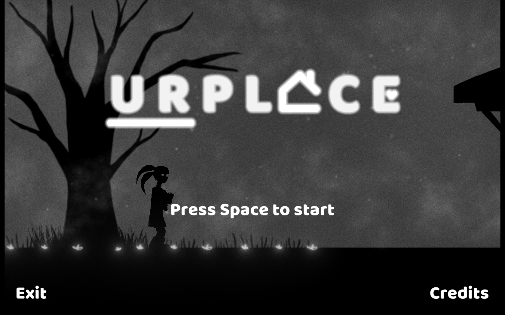

# Urplace

What home means to you?

We hope that this journey will be the key to finding the right answer to this question.

Experience the journey of a young lady to find her home and to find urplace.

Urplace is our game for the Global Game Jam 2019 #GGJ19 occurred in January 25 - 27, 2019.

## Overview

The game was developed by 5 developers during the Global Game Jam 2019. The game jam had the theme: "What Home Means To You?". The game was developed during the 48 hours of Global Game Jam and we improved its visuals and gameplay during this last week. In all, the game was produced over a period of 12 days.

## Downloads and Links

You can play it in your browser.

Windows and macOS and HTML5 (WebGL)

https://dormirnaodaxpstudio.itch.io/urplace

## Global Game Jam

The Global Game Jam is the world's largest game jam event (game creation) taking place around the world at physical locations. Think of it as a hackathon focused on game development. It is the growth of an idea that in today’s heavily connected world, we could come together, be creative, share experiences and express ourselves in a multitude of ways using video games – it is very universal. The weekend stirs a global creative buzz in games, while at the same time exploring the process of development, be it programming, iterative design, narrative exploration or artistic expression. It is all condensed into a 48 hour development cycle. The GGJ encourages people with all kinds of backgrounds to participate and contribute to this global spread of game development and creativity.

[Urplace in Global Game Jam 2019](https://globalgamejam.org/2019/games/urplace)

## Developers

* [Isabelle Oliveira](https://www.linkedin.com/in/1sabelle0liveira) - @izz1e
  * 3D Modeling, Level Designer & UI Designer
* [Marcelo Chaves](https://www.linkedin.com/in/marcelochaves95) - @marcelochaves95
  * Gameplay Programmer, UI Programmer & Sound Designer
* [Renê Queiroz](http://www.linkedin.com/in/reneq) - @nywlmac
  * Animator & Character Modeling
* [Rodrigo Vieira](https://www.linkedin.com/in/rodrigo-vieira-developer) - @Rgov-BR
  * Game Designer, Level Designer, Gameplay Programmer & Sound Designer
* [Thaynan Nadu](https://www.linkedin.com/in/thaynan-nadu-60b370100) - @Thaynannadu
  * 2D Environment Artist & Level Designer 
* Special thanks to [Diogo Rocha](https://www.linkedin.com/in/diogo-rocha-256769a2) - @haykath for his help with 2D Character Controller and PUC Minas, for hosting the event.
  
## License
MIT license. See the [`LICENSE`](LICENSE) file for details.
